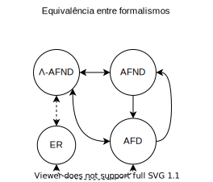

## Automata λ - Conversões

Os diferentes formalismos apresentados durante a disciplina possuem equivalências, como apresentado abaixo.

    

 Assim, esta seção do repositório apresenta os principais conceitos de conversão entre formalismos vistos em sala de aula. 

##### Conteúdo

- [Conversão ANFD para AFD](afnd_afd);
- [Conversão de ER para AFND](er_anfd).
