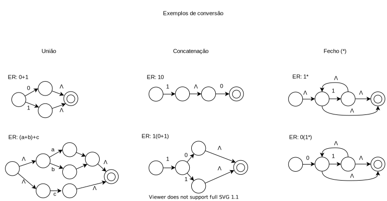

## Conversão de uma expressão regular (ER) para um autômato finito com transições Épsilon (E-AFND)

Como já citado em outras partes deste repositório, os formalismos apresentados, em diversos casos, apresentam equivalência entre si. Este documento tem por objetivo apresentar de forma geral as regras utilizadas para a conversão de ER para E-AFND.

### Conversão

Abaixo é apresentado um resumo dos conceitos necessárias para a conversão de uma ER para um autômato finito.

### Exemplos de conversão

Com base nas operações que foram apresentadas, algumas conversões de exemplo foram criadas, estas apresentadas abaixo.

