### Fundamentação da Teoria da Computação e Linguagens Formais - Linguagens regulares

01) Desenvolva AFD que reconheçam as seguintes linguagens sobre Σ = {a, b}

a) {w | w possui aaa como subpalavra}

<div align="center">
    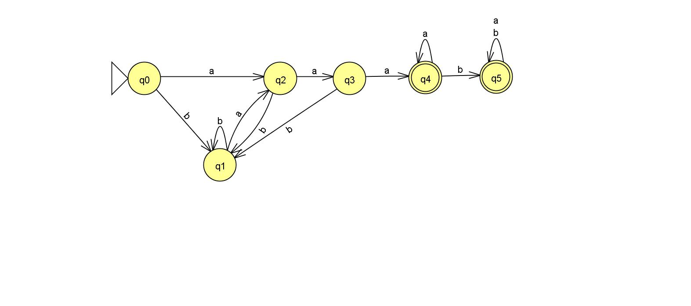
</div>

b) {w | o sufixo de w é aa}

<div align="center">
    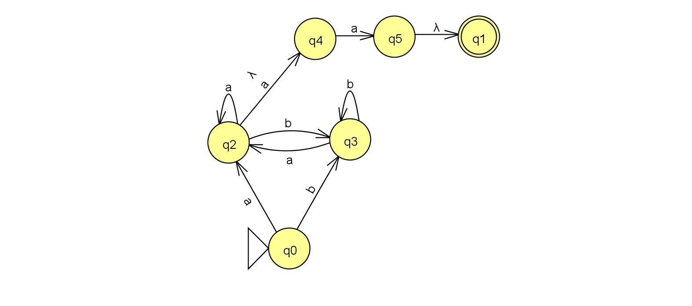
</div>

c) {w | w possui número ímpar de a e b} 

<div align="center">
    
</div>

2) Desenvolva AFN que reconheçam as seguintes linguagens sobre Σ = {a,b}

a) {$w_1$ $w_2$ $w_1$ | $w_2$ é qualquer e |$w_1$| = 3}

<div align="center">
    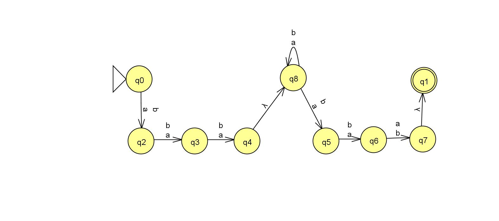
</div>

b) {w | o décimo símbolo da direita para a esquerda de w é a} 

<div align="center">
    
</div>

3) Mostre  a  seqüência  de  configurações  assumidas  pelo  AFD  abaixo  durante  a  análise  das  cadeias  `abcdabc` e `abdabcd`. Determine se essas cadeias pertencem ou não a linguagem reconhecida pelo AFD. 

M = ({ q0, q1, q2, q3}, { a, b, c, d }, δ, q0, {q3})  

δ(q0, a) = q1
δ(q1, b) = q2
δ(q2, c) = q3
δ(q3, c) = q3
δ(q3, d) = q0

Para facilitar o entendimento dos passos realizados pelo AFD, façamos a representação visual através de um grafo direcionado

<div align="center">
    
</div>

Com a visualização do autômato, é possível verificar qual será aceita e qual não será. Desta forma temos que:

| Cadeia de entrada |      Status     |
|:-----------------:|:---------------:|
|      abcdabc      |   Reconhecido   |
|      abdabcd      | Não Reconhecido |

Para entender melhor como cada um dos comportamento foi obtidos, vejamos os passos realizados pelo autômato.

- Para a cadeia `abcdabc`

<div align="center">
    
</div>

- Para a cadeia `abdabcd`

<div align="center">
    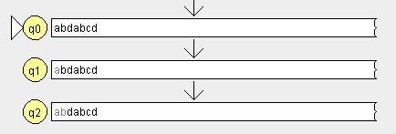
</div>

4) Considere a Gramática Linear à Direita, G = ({S, A, B}, {a,b}, P, S), onde P é dado por

P = { S → aA, A → bB, B → cC, C → c}

Mostre 5 cadeias geradas por G. Encontre o Autômato Finito M = {Q, {a, b}, $\delta$, S, F} que reconhece a linguagem gerada por G.

* Produções
  * abbba
  * abba
  * aa
  * aaaa
  * abbbaa

As produções desta gramática sempre começam e terminam com `a`.

* Autômato para reconhecer a linguagem gerada por esta gramática

<div align="center">
    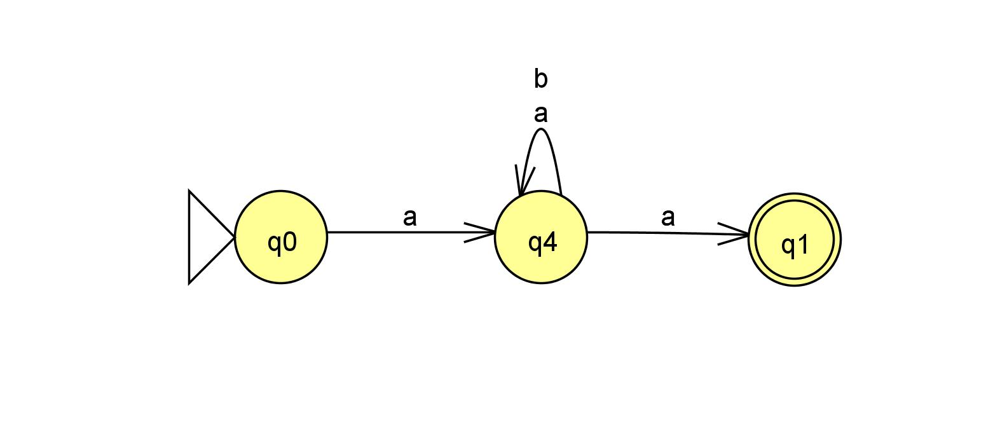
</div>

5) Considere a Gramática Linear à Direita, G = ({S, X, Y}, {a,b,c}, P, S), onde P é dado por

P = { S → aX | λ, X → bX | bbY | c, Y → cY | cc | abc | λ}

Mostre 5 cadeias geradas por G. Encontre o Autômato Finito M = {Q, {a,b,c}, δ , S, F} que reconhece a linguagem gerada por G

* Produções
  * abc
  * abbccc
  * abbbabc
  * abbcc
  * ac

* Autômato para reconhecer a linguagem gerada por esta gramática

<div align="center">
    
</div>

* Consideração sobre o tipo de linguagem.

No exercício original há uma pequena regra de produção que altera o tipo da gramática

Para o exercício original as seguintes regras de produção eram consideradas
P = { S → aX | λ, X → bX | bbY | c, Y → Yc | cc | abc | λ}

Porém se for observado atentamente, a produção Y → Yc é linear à esquerda, enquanto todas as demais são lineares a direita, o que faz esta não ser uma linguagem regular, somente livre de contexto.

Então para se adequar ao contexto dos exercícios a regra foi alterada, gerando a seguinte.

P = { S → aX | λ, X → bX | bbY | c, Y → cY | cc | abc | λ}

Por conta de cursiosidade sobre como ficaria a forma de produção dessas regras com essa mudança, gerei uma produção de cada uma no JFlap.

Para a gramática livre de contexto, a produção teria esta aparência

<div align="center">
    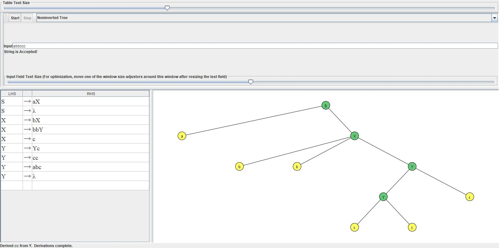
</div>

Para a gramática regular, a produção fica parecido com o que foi apresentado no exercício, como pode ser visto abaixo.

<div align="center">
    
</div>

Isto não mudaria muito a linguagem gerada pela gramática, pelo menos nos testes feitos durante o exercício, porém para outras cadeias não testadas comportamentos diferentes poderiam ser gerados.

6) Considere  o  Autômato  Finito  M  que  reconhece  a  Linguagem  L  =  {w  |  w  possui  aa  ou  bb  como  subcadeia}, então M  = { {q0, q1, q2, q3}, {a,b}, δ , q0, {q3}}

|   δ   |   a   | b     |
|:-----:|:-----:|-------|
| $q_0$ | $q_1$ | $q_2$ |
| $q_1$ | $q_3$ | $q_2$ |
| $q_2$ | $q_1$ | $q_3$ |
| $q_3$ | $q_3$ | $q_3$ |

Encontre a Gramática  G = (V, {a,b}, P, S) que reconhece a linguagem gerada por G

* Visualizando o autômato da tabela

Para facilitar o processo de visualização do autômato presente na tabela, uma representação gráfica do mesmo, criada com grafos direcionados, foi feita.

<div align="center">
    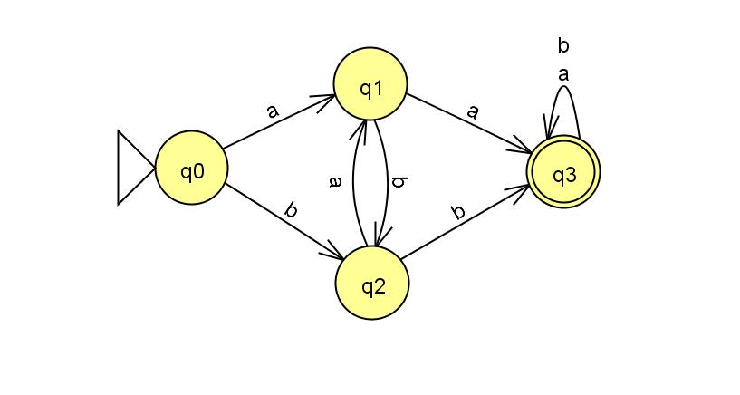
</div>

* Geração da gramática

A gramatica definida foi G = { {A, B, C}, {a, b}, P, S }, sendo as produções de P descritas na Figura abaixo

<div align="center">
    
</div>

Com estas produções é possível reconhecer a mesma linguagem do autômato definido pelo exercício, fazendo com que $L(A) = L(G)$.

* Validando as produções

Para testar, uma cadeia aceita pelo autômato definido no exercício foi testado com o JFlap, o resultado pode ser visto na Figura abaixo.

<div align="center">
    
</div>

7) Mostre a seqüência de configurações assumidas pelo AFD abaixo durante a análise das cadeias `abbca` e `abaac`. Determine se essas cadeias pertencem ou não a linguagem reconhecida pelo AFD

Considere o autômato M = ({q0, q1}, { a, b, c }, δ, q0, {q1}), onde δ é 

δ(q0, a) = q1
δ(q1, b) = q1
δ(q1, c) = q0 

* Visualização do AFD

<div align="center">
    
</div>

* Análise das cadeias reconhecidas

Seguindo as regras de transição do autômato, a cadeia `abbca` é reconhecida. Já a cadeia `abaac` não é reconhecida, a mesma requer transições que não produzem transições, o que leva o autômato a não ser finalizado.

As configurações assumidas durante a leitura de cada uma das cadeias são:

- `abbca`

<div align="center">
    
</div>

- `abaac`

*Perceba que para esta cadeia, a fita de entrada não é inteiramente lida, já que o autômato encontra uma transição inválida*

<div align="center">
    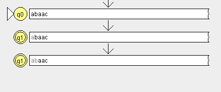
</div>

**8) Seja M um AFN com M = ({ q0, q1, q2 }, { 0, 1 }, δ, q0, {q1}), com δ sendo:**

δ(q0, 0) = {q0 , q1}
δ(q1, 0) = {q2}
δ(q2, 1) = {q2}
δ(q0, 1) = {q1}
δ(q1, 1) = {q2}

Mostre 5 cadeias reconhecidas por M. Encontre o AFD equivalente

* Visualização do AFN

<div align="center">
    
</div>

* Cadeias reconhecidas por `M`

- 000001
- 0000001
- 000000001
- 00000000001
- 001
- 01
- 0

* Transformando o AFN em AFD

Para a transformação a regra utilizada foi a de agrupamentos dos estados. Sendo definido como estado final, aquele grupo que possuir em sua componente ao menos um símbolo de estado final do AFN.

A tabela abaixo foi utilizada para a realização da conversão. Do lado esquerdo o AFN e do lado direito seu correspondente em AFD

| Estados 	|    0   	|  1 	|   	|    Estados   	|       0      	|     1    	|
|:-------:	|:------:	|:--:	|:-:	|:------------:	|:------------:	|:--------:	|
|    q0   	| q0, q1 	| q1 	|   	|     {q0}     	|   {q0, q1}   	|   {q1}   	|
|    q1   	|   q2   	| q2 	|   	|     {q1}     	|     {q2}     	|   {q2}   	|
|    q2   	|        	| q2 	|   	|   {q0, q1}   	| {q0, q1, q2} 	| {q1, q2} 	|
|         	|        	|    	|   	|     {q2}     	|              	|   {q2}   	|
|         	|        	|    	|   	| {q0, q1, q2} 	| {q0, q1, q2} 	| {q1, q2} 	|
|         	|        	|    	|   	|   {q1, q2}   	|     {q2}     	|   {q2}   	|
|         	|        	|    	|   	|   {q1, q2}   	|     {q2}     	|   {q2}   	|

Ao final deste processo, o seguinte AFD foi gerado

<div align="center">
    
</div>

Para validar a conversão, o mesmo passo foi feito através do JFlap, o resultado do mesmo é apresentado abaixo. 

<div align="center">
    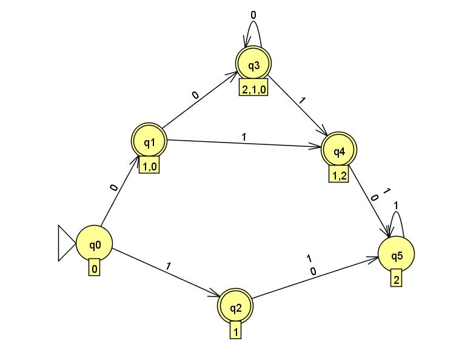
</div>

É possível perceber a equivalência entre os AFDs gerados, variando apenas na nomenclatura utilizada para os estados.

**9) Seja M um AFN com M = ({ q0, q1, q2}, { 0, 1 }, δ, q0, {q1}), com s sendo: δ**

δ(q0, 0) = {q0}
δ(q1, 0) = {q2}
δ(q2, 0) = {q2}
δ(q0, 1) = {q1}
δ(q1, 1) = { q1, q2 }
δ(q2, 1) = {q1}

Mostre 5 cadeias reconhecidas por M. Encontre o AFD equivalente

* Visualização do AFN

<div align="center">
    
</div>

* Cadeias reconhecidas por `M`

As cadeias reconhecidas pelo AFN `M` são todas aquelas terminadas em 1

- 00011100001
- 0001
- 0010101
- 01
- 00111101
- 000011

* Transformando o AFN em AFD

Para a realização da conversão a tabela apresentada abaixo foi utilizada, nessa o conceito de agrupamento de estados foi realizada.

Na esquerda é representado o AFN e na direita o AFD

| Estados 	|  0 	|    1   	|   	|    Estados   	|       0      	|     1    	|
|:-------:	|:--:	|:------:	|:-:	|:------------:	|:------------:	|:--------:	|
|    q0   	| q0 	|   q1   	|   	|     {q0}     	|     {q0}     	|   {q1}   	|
|    q1   	| q2 	| q1, q2 	|   	|     {q1}     	|     {q2}     	| {q1, q2} 	|
|    q2   	| q2 	|   q1   	|   	|   {q1, q2}   	|     {q2}     	| {q1, q2} 	|
|         	|    	|        	|   	|     {q2}     	|     {q2}     	|   {q1}   	|
|         	|    	|        	|   	| {q0, q1, q2} 	| {q0, q1, q2} 	| {q1, q2} 	|
|         	|    	|        	|   	|   {q1, q2}   	|     {q2}     	|   {q2}   	|
|         	|    	|        	|   	|   {q1, q2}   	|     {q2}     	|   {q2}   	|

O AFD apresentado na tabela pode ser visualizado no grafo abaixo.

<div align="center">
    
</div>

**10) Construir um AFN que aceita a linguagem associada às seguintes ER:**

- a) r  = a* (a a + b b)

<div align="center">
    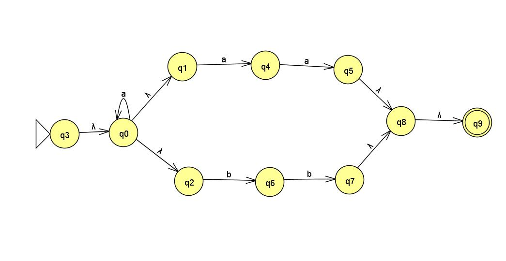
</div>

- b) r = (a + b)* (a + b b)

*Este autômato precisa ser otimizado, mas por hora, ele é capaz de interpretar a mesma cadeia que a expressão regular representa*

<div align="center">
    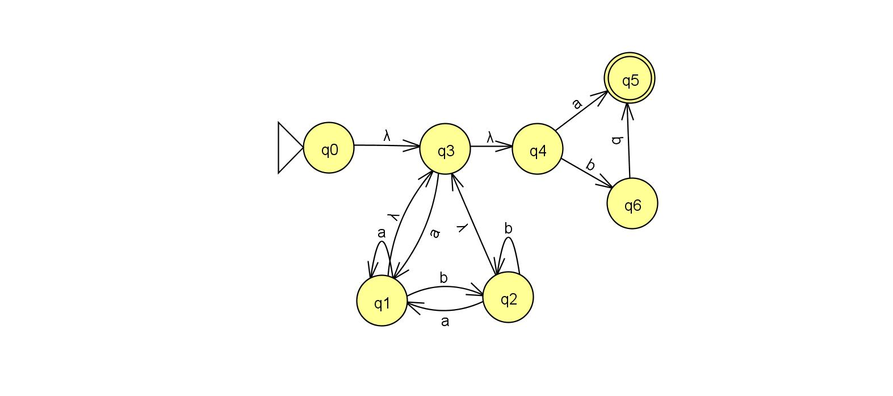
</div>

- c) r = (a a) * (b b )* b

<div align="center">
    
</div>

**11) Construa a Expressão Regular (ER) que represente as linguagens sobre Σ = {a, b, c, d}**

- a) {w | w possui no mínimo um símbolo a}

```
(a+b+c+d)*a(a+b+c+d)*
```

Para a criação da expressão regular a seguinte ideia foi utilizada. O valor de `a` deve estar presente na cadeia reconhecida pela ER, então, um fecho transitivo reflexivo foi utilizado antes e depois do caractere `a`, isto permite que, antes dele possa vir qualquer elemento, inclusive nenhum, e após também.

- b) {w | w possui exatamente dois símbolos a}

```
(b+c+d+e)*a(b+c+d+e)*a(b+c+d+e)*
```

Para a solução deste exercício a mesma lógica aplicada no exercício `a` foi utilizada.

- c) {w | w possui um número par de símbolos a}

```
((b+c+d+e)*a(b+c+d+e)*a(b+c+d+e)*)*
```

- d) {w | w é iniciada com o símbolo `a` e termina com o símbolo `b` ou `c`}

```
a(a+b+c+d+e)*(b+c)
```

- e) {w | w contem apenas os símbolos a, b, c com no mínimo um símbolo}

```
(a+b+c)*(a+b+c)(a+b+c)*
```

**Sobre os exercícios**: Os exercícios presentes nesta página foram retirados das seguintes referências:
- [Lista de exercícios - UEM](http://www.din.uem.br/yandre/TC/lista3-resp.pdf);
- [Lista de exercícios - UNESP](http://wwwp.fc.unesp.br/~simonedp/zipados/Lista-TC02.pdf)

**Software utilizado**: Os exercícios acima foram desenvolvidos e validados com o auxílio do [JFlap](http://www.jflap.org/jflaptmp/)
