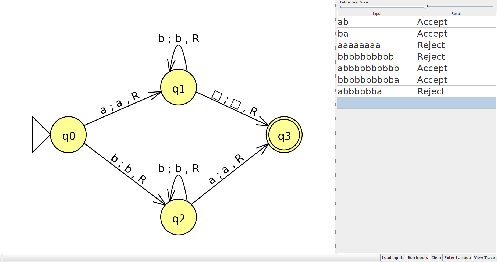
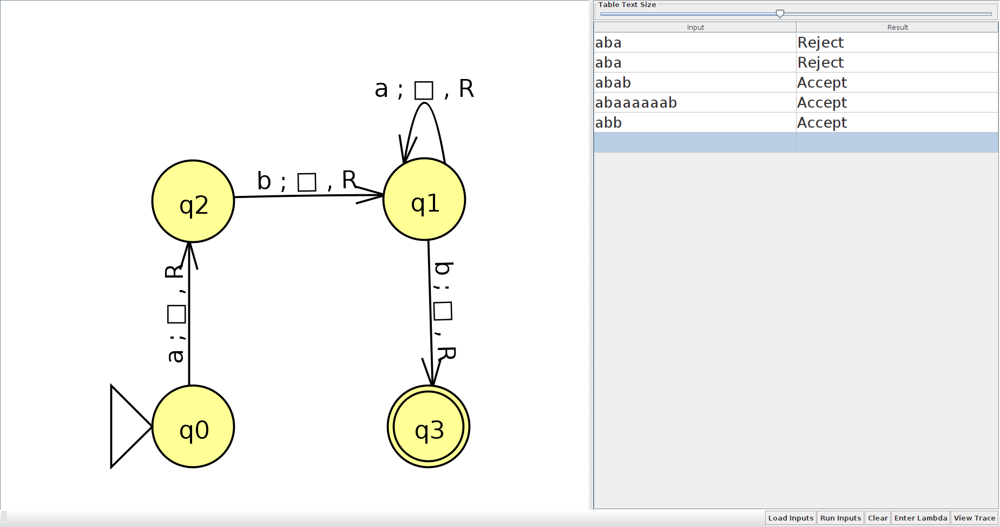

### Fundamentação da Teoria da Computação e Linguagens Formais - Máquinas de turing

1) **Qual a linguagem aceita pela Máquina de Turing    M = ({q0,q1,q2,q3}, {a,b}, {a,b,$\square$}, δ,  q0,  {q3}), onde:**

δ(q0, a) = (q1, a, R), 
δ(q0, b) = (q2, b, R), 
δ(q1, b) = (q1, b, R), 
δ(q1, $\square$) = (q3, $\square$, R),
δ(q2, a) = (q3, a, R),
δ(q2, b) = (q2, b, R).

O primeiro passo para verificar as linguagens reconhecidas pela máquina M foi criar uma representação gráfica da mesma, para uma visualização inicial e possívelmente ajuda durante o reconhecimento das cadeias de entrada.

    

Com a visualização da máquina sendo feita através de um grafo, já foi possível perceber os padrões de entrada, então alguns testes com diferentes cadeias foram feitos.

* δ(q0, [a]b) → δ(q1, a[b]) → δ(q1, ab$\square$) → δ(q3, ab$\square$) (**Cadeia aceita**)
* δ(q0, [a]ab) → δ(q1, a[a]b) (**Cadeia rejeitada**)

Bem, com os testes acima e interpretado as regras foi possível perceber que as cadeias aceitas por M são aquelas que começam ou terminam com o símbolo `a`, sendo que este símbolo não aparece nas cadeias em sequência. Para comprovar tal questão, mais testes foram feitos utilizando o JFlap.

    

2) **Construa Máquinas de Turing que aceitem as linguagens**

a) L = L(aba*b)

M = ({q0, q1, q2, q3}, {a, b}, {a, b, $\square$}, P, q0, {q3}), sendo P:

δ(q0, a) = (q2, $\square$, R),
δ(q2, b) = (q1, $\square$, R),
δ(q1, a) = (q1, $\square$, R),
δ(q1, b) = (q3, $\square$, R), 

Para validar a máquina criada, as regras foram postas no JFlap e validadas com múltiplas execuções.

    

b) L = { $1^n2^n$ | n ≥ 0 }

M = ({q0, q1, q2, q3, q4}, {1, 2}, {1, 2, x, y, $\square$}, P, q0, {q4}), sendo P:

δ(q0, 1) = (q1, x, R),
δ(q1, 1) = (q1, 1, R),
δ(q1, y) = (q1, y, R),
δ(q1, 2) = (q2, y, L),
δ(q2, 1) = (q2, 1, L),
δ(q2, y) = (q2, y, L),
δ(q2, x) = (q0, x, R),
δ(q0, y) = (q3, y, R),
δ(q3, y) = (q3, y, R),
δ(q3, $\square$) = (q4, $\square$, R),

A validação da máquina criada é apresentada abaixo

    

**Sobre os exercícios**: Os exercícios presentes nesta página foram retirados das seguintes referências:
- [Lista de exercícios - UNESP](http://wwwp.fc.unesp.br/~simonedp/zipados/Lista-TC04.pdf)

**Software utilizado**: Os exercícios acima foram desenvolvidos e validados com o auxílio do [JFlap](http://www.jflap.org/jflaptmp/)
