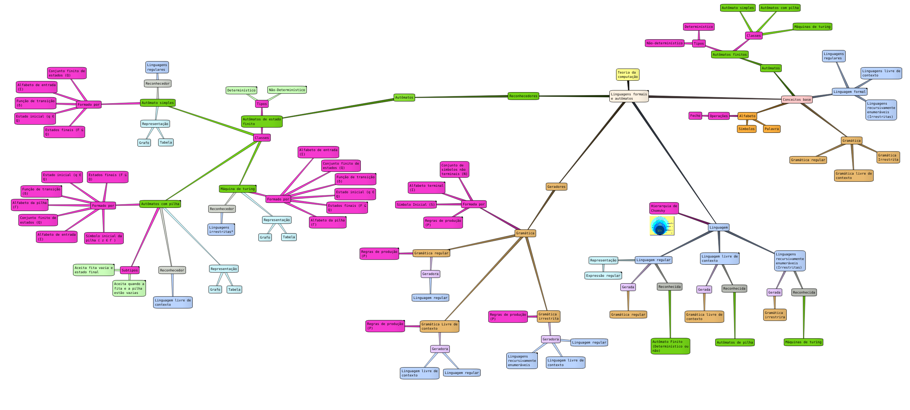

## Automata λ - Mind Map

Como forma de fixar todos os conteúdos apresentados durante as aulas de Linguagens formais e autômatos, esta seção apresenta mapa mental vinculando os principais conteúdos da disciplina.

> Recomenda-se a utilização do Semantik para a visualização completa do mapa e todas as anotações feitas no mesmo

    

##### Sobre

Para a geração do mapa mental foi feita a utilização do programa [Semantik](https://waf.io/semantik.html).
